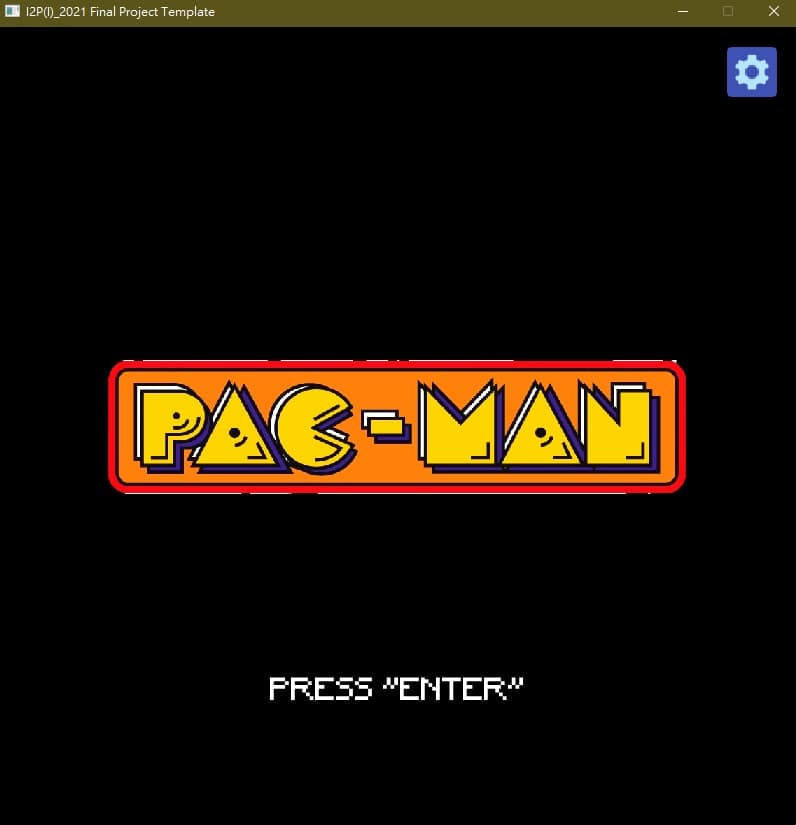
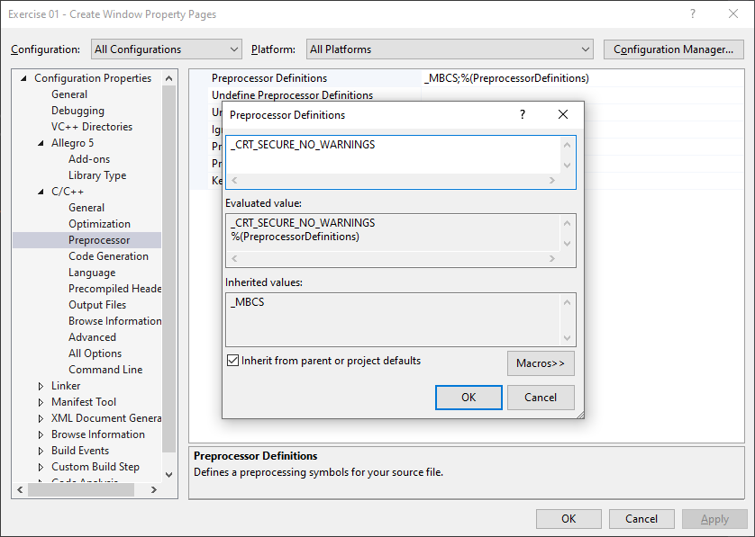
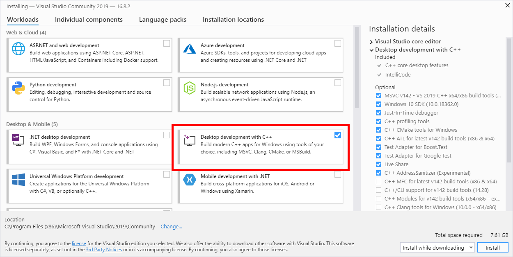
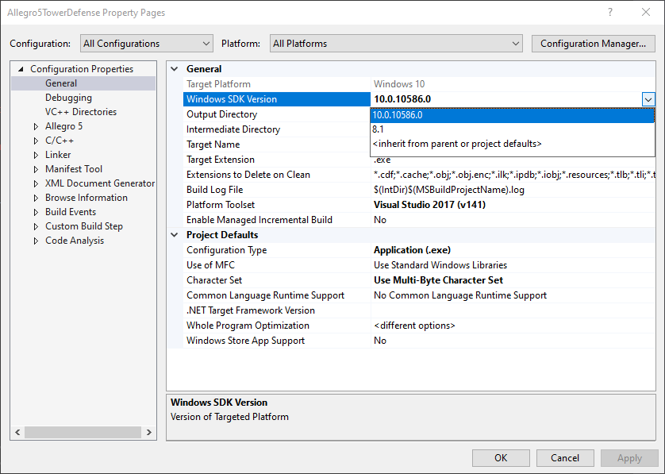
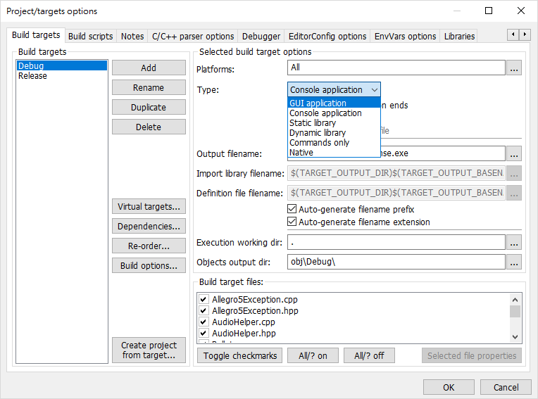
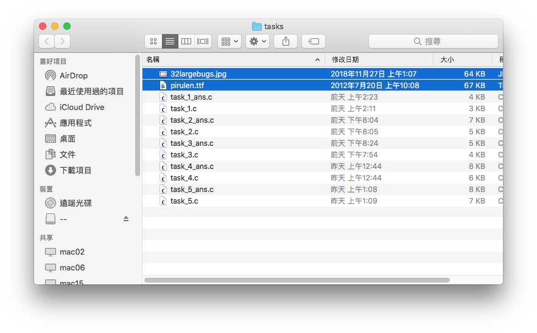

# Allegro 5 Pacman Game Template



Related Links:
- [Exercises](/Exercises)
- [Exercises step-by-step video](https://youtu.be/Araij6j6QME)
- [Exercises Template](https://github.com/j3soon/Allegro5Template/releases/download/v2020/Exercises.Template.zip)
- [Final Code](/Final_Codes)
- [Allegro5 Wiki](https://github.com/liballeg/allegro_wiki/wiki)

## Installation

Follow the steps [here](docs/README.md).

- [Official Guide](https://github.com/liballeg/allegro_wiki/wiki/Quickstart)
- [Linux(Debian)](docs/README.md#linux-debian)
- [Windows](docs/README.md#windows)
  - [Visual Studio](docs/README.md#visual-studio): [Video](https://youtu.be/HPHd92nj0Io)
  - [Code::Blocks](docs/README.md#codeblocks): [Video](https://youtu.be/6qzWKRxw9eY)
  - [Dev-C++](docs/README.md#dev-c): [Video](https://youtu.be/lwscVtIUy6k)
- [Mac OS](docs/README.md#mac-os)
  - [XCode](docs/README.md#xcode): [Video](https://youtu.be/QZdHjFQUQPo)
- [Others](docs/README.md#others)

<!--## Examples-->

## Useful Links

- Official Site

  [Allegro - A game programming library](https://liballeg.org/)

- Documentations

  [Allegro 5 reference manual](https://liballeg.org/a5docs/trunk/)

  [Allegro 5.0 reference manual](https://www.allegro.cc/manual/5/)

- GitHub repo of Allegro 5

  [Source Code](https://github.com/liballeg/allegro5)

  [Examples](https://github.com/liballeg/allegro5/tree/master/examples)

- GitHub repo of I2P(I) final project before 2020
  [Source Code](https://github.com/j3soon/Allegro5Template)

## Tutorials

[C++ Allegro 5 Made Easy](https://www.youtube.com/watch?v=IZ2krJ8Ls2A&list=PL6B459AAE1642C8B4 )

[2D Game Development Course](http://fixbyproximity.com/2d-game-development-course/)

[Allegro Game Library Tutorial Series](https://www.gamefromscratch.com/page/Allegro-Tutorial-Series.aspx)

## FAQ

### Final Project

- If you want to use GIF images, you can download the plugin [algif](http://algif.sourceforge.net/).

  It can be used like videos after putting the library under your project folder.

- If you want to load MP3 audio, you can try out streaming as mentioned [here](https://github.com/liballeg/allegro_wiki/wiki/Allegro-Vivace).

- If you play multiple BGMs or sound effects at the same time, the `al_play_sample` could fail.

  You can either:

  1. Set `RESERVED_SAMPLES` to a higher value.
  2. Don't abort if `al_play_sample` fails.

- Unable to find resources when open the executable file located in `...\bin\` directly.

  You can copy all used resources to the `...\bin` folder, since the executable file searches for the resources file located in the same folder.

- Error message: `assertion failed ... bitmap_draw...`

  A high chance is that you didn't initialize one of your image file before drawing it. e.g.

  ```c
  ALLEGRO_BITMAP* img;
  ...
  al_draw_bitmap(img, ...);
  ```

  The full error message:
  ```
  Assertion failed!

  Program: <PATH>\final.exe
  File: <PATH>/bitmap_draw.c, Line 140

  Expression: bitmap
  ```

- `al_load_bitmap`, `load_resized_bitmap` keeps failing, but I've done nothing wrong.

  Some image files you downloaded from the internet might be in the incorrect format. You can open it in PhotoShop, GIMP, Paint.NET, ... and re-save it as `*.png` or any format you want. This problem occurs sometime if you are using Chrome, but it doesn't occur if you use Firefox.

  For example: You can try to save this image: [http://img1.3png.com/340af8a9dd2e666738f797b6573a963e1e8f.png](http://img1.3png.com/340af8a9dd2e666738f797b6573a963e1e8f.png). Although it says it's a `PNG` file, but it's actually a `JPEG` file. If you don't believe it, you can open it in Notepad, Notepad++, ... You'll see the `JFIF` at the beginning lines, if it's a `PNG` file, you should see ` NG`.

- Task 1, 2, 3 are independent, you can test the game behavior after finishing each part.

- If your game lags (drop frames), you can comment out the line below:

  ```c
  #define LOG_ENABLED
  ```

- If your game loading time is very long, it is caused by the large music files. You can change the file to other audio, or simply disable (don't load) background music.

- `Space` key cannot be detected.

  You should change your input from `Chinese` to `English`, otherwise the keycode will be different.

### Installation Issue on Windows
- LNK2019 or LNK2001 bug in Visual Studio
	- Try turn the option "Project -> Project Property -> Configuration Properties Whole Program Optimization" to "Use Link Time Code Generation
- "\ZI \GL is not compatible" Problem in Visual Studio
	1. Turn "Project Property -> Configuration Properties -> C/C++ -> General -> Debug Information Format" to "none" or others (Just don't include \ZI)
	- **Remember to install the Allegro addons by yourself** !!
- `fopen is not safe ...` in Visual Studio

  - Add `#define _CRT_SECURE_NO_DEPRECATE`/`#define _CRT_SECURE_NO_WARNINGS` at the top of your `main.c` file.

  - Or you can set it in the Project Settings.

    

- Cannot compile on Visual Studio. (`unresolved external symbol`...)

  - Remember to check `Support C++ Desktop` when installing.

    

  - When setting the configuration of Allegro5 plugins, make sure to set in `All Configurations` and `All Platforms`.

    

  - When Visual Studio complains the Windows SDK Version / Platform Toolset is not found, choose any downloaded `Windows SDK Version` and any `Platform Toolset`. (Make sure the options you chose are installed in your computer)

    

    

- Cannot compile on Code::Blocks.

  For Code::Blocks you should create a project following the tutorial above, and set the project settings to allow C++11.

  

  The settings are almost the same in other IDEs.

  For `'abs(float&)' is ambiguous` you can change `abs` to `fabs`.

- File `allegro-5.0.10-monolith-mt-debug.dll` is missing in Code::Blocks

  Find the file `allegro/bin/allegro-5.0.10-monolith-mt-debug.dll` located inside the unzipped library folder.

  Copy it to your project folder under `bin\Debug`. If these folders don't exist, you can create them by yourself, or simply compile and run the code, your IDE will create them for you.

- `task_2_ans.c` compile error in Code::Blocks.

  ```
  error: could not convert 'al_init_font_addon()' from 'void' to 'bool'
  ```

  Change

  ```c
  if (!al_init_font_addon())
      game_abort(...);
  ```

  to

  ```c
  al_init_font_addon();
  ```

- Header not found using the new version Allegro5.2 in Dev-C++

  `fatal error: allegro5/allegro.h: No such file or directory`

  The include and library paths assume that you have extracted the library using the built-in `Extract All...`, and put it into the C drive.

  A way to check if you had put them in the correct path is to see if the include path really exists in the file system.

- Cannot find resource files (when running task_2_ans.c)

  You should drag your files (pirulen.ttf, 32largebugs.jpg) into your project folder (same folder as your `main.c` or `task_n_ans.c`).

- Redefinition of ...

  You need to keep only one `main` function in one project, for example you may have both `task_1_ans.c` and `task_2_ans.c` in your project. You should only keep one.

  Or you might accidentally edit the Allgero5 library header, re-installing the library may help.

- When reopen the project, all settings are gone.

  For Code::Blocks you should open the `*.cbp` file.

  For Dev-C++ you should open the `*.dev` file. If all files disappear, use `Project > Add To Project...` and select all files.

- On Code::Blocks Release mode: `The Application was Unable to Start Correctly (0xc000007b)`

  You should copy both `allegro_monolith-5.2.dll` and `allegro-5.2.dll` to your `/Release` folder.

- I want to hide the console window.

  For Code::Blocks, set the build target type to `GUI application`.

  

  For Visual Studio, set the `Subsystem` to `Windows (/SUBSYSTEM:WINDOWS)`.

  

  For other IDEs there are also such settings.

- In Visual Studio, how to swap between the start up project in Exercises?

  Right-click a project and `Set as StartUp Project` and recompile.

  

### Installation Issue on Mac OS

- **(This issue should not occur now)** There are OpenGL related bugs in newer version of XCode make sure to use XCode versions prior or equal to 10.3.

  Or you can use a custom Makefile.

- Command not found - brew

  When installing homebrew, it'll ask you to press `Return` to continue, you must press `Enter` and type your password to continue installing.

  If you press any other keys, it'll abort the installation process.

- Password are not read by terminal

  The password you type won't be shown on the terminal (it won't have something like `****`). You can just type your password and press `Enter`.

- Cannot find resource files (when running `task_2_ans.c`)

  You should drag your files (`pirulen.ttf`, `32largebugs.jpg`) into your project.

  
  
  
  
  

- Redefinition of ...

  You need to keep only one `main` function in one project, for example you may have both `task_1_ans.c` and `task_2_ans.c` in your project. You should only keep one.

  Or you might accidentally edit the Allgero5 library header (e.g. `fmaths.inl`), re-installing the library using the command below may help.

  ```shell
  brew uninstall allegro
  brew install allegro
  ```

- `dyld: Library not loaded` ...

  You need to `brew install allegro` on your Mac. For the detailed steps, please refer to the XCode installation guide.

- Suggestion: Legacy Build System
    - If you see some missing error messages, please switch to the legacy build system. Please refer [here](https://stackoverflow.com/questions/51205221/how-can-i-use-the-legacy-build-system-with-xcode-10s-xcodebuild) 
# Final_Project_Shih
